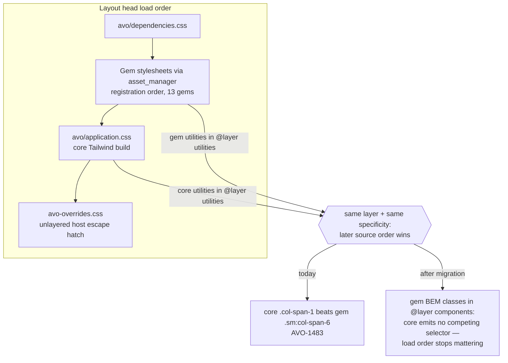
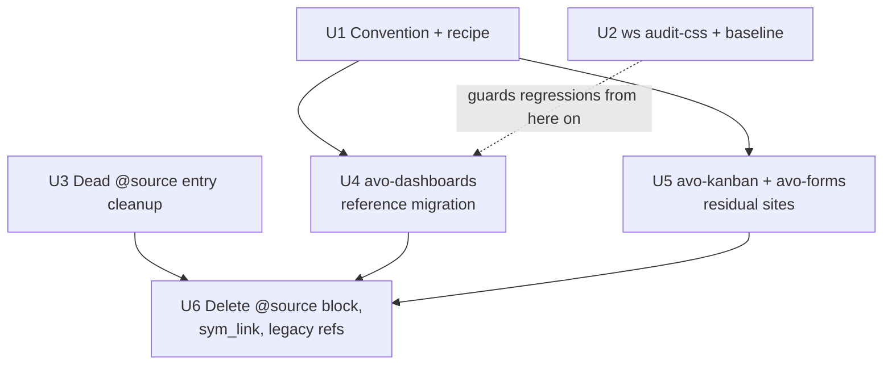

# Cross-Gem CSS Authoring Policy - Plan

## Goal Capsule

- **Objective:** Gem UI renders correctly in host apps that run no Tailwind build of their own, and avo core stops scanning gem sources for CSS. Achieved by a semantic component-class authoring convention (kanban-style BEM + `@apply`), migration of all variant-utility sites in the gems core currently scans, deletion of the `@source` block and `avo:sym_link` rake task, and a `ws audit-css` CI guard.
- **Product authority:** the Product Contract below; Key Technical Decisions carry session-settled annotations from the planning dialogue.
- **Open blockers:** none. Deferred follow-up work (remaining latent-risk gems) is tracked in Scope Boundaries and does not block this plan.
- **Stop conditions:** surface as a blocker (rather than improvising) any variant utility that cannot be expressed as a compiled BEM class, or evidence that trimming a `@source` entry breaks a released host app.

---

## Product Contract

### Summary

Establish a workspace-wide rule that gem markup carries no responsive/state variant utilities, migrate the variant sites in the `@source`-covered gems (dashboards, kanban, forms) to gem-owned BEM component classes, delete core's gem-scanning mechanism entirely, and guard the rule with a baseline-driven `ws audit-css` CI check. Remaining gems follow later using the recipe this plan produces.

### Problem Frame

Thirteen gems register stylesheets through `Avo.asset_manager.add_stylesheet`; the layout renders them **before** core's stylesheet (`external/avo/app/views/layouts/avo/application.html.erb`, lines 25-28). Both gem builds and core's build emit Tailwind v4 utilities into `@layer utilities`, so when core's build contains a base utility competing with a gem's variant utility on the same property, core wins by source order — `col-span-1` overrides `sm:col-span-6` (AVO-1483, dashboards grid regression on HQ).

Core's existing mitigation — scanning symlinked gem sources via `@source` directives so gem utilities compile into core's own sheet — is self-described as a hack in `external/avo/app/assets/stylesheets/application.css`, requires a core release whenever gem markup changes, uses hardcoded and diverging gem lists, and is not wired into the release build (`avo:sym_link` is a manual dev step), so shipped core CSS does not reliably include the scanned utilities anyway. Host apps that run their own Tailwind build (avodemo) mask the bug; host apps that don't (HQ, customer apps) hit it.

### Requirements

**Authoring policy**

- R1. Gem markup (`.erb` templates and Ruby-emitted class strings) carries no responsive/state variant utilities; variant-dependent styling is expressed through BEM component classes compiled via `@apply` (or plain CSS properties) in the gem's own stylesheet, in `@layer components`.
- R2. The convention and a per-gem migration recipe are documented in the workspace rules so future gem work follows the pattern without archaeology.
- R3. Migrated CSS uses `var(--color-*)` design tokens for themed colors (runtime resolution against the host theme, since gem sheets load before core); raw palette values already present on migrated elements are preserved verbatim — retheming is out of scope.

**Decoupling core from gems**

- R4. Core's `@source` gem-scanning block and the `avo:sym_link` rake task are deleted; a gem markup change never again requires an avo core release. The unrelated `safelist.txt`, `@source inline(...)`, and `@source not` entries stay.
- R5. Each live `@source` entry is trimmed only after its gem is migrated or verified self-sufficient (dead entries may go immediately).

**Migration**

- R6. avo-dashboards is the reference migration: every variant site including the Ruby-emitted class tables (`cols`/`rows`/`grid_cols`) converts to compiled BEM modifiers; the public card API (`cols:`, `rows:`, `grid_cols`) is unchanged.
- R7. avo-kanban's and avo-forms' residual variant sites are migrated, bringing the live `@source` set to zero.

**Guard**

- R8. `ws audit-css` fails CI when a new variant utility appears in gem markup (`gems/*/app` and `gems/*/lib`, `.erb` and `.rb`, excluding dummy apps), with a baseline covering not-yet-migrated gems that shrinks as follow-up migrations land.

**Verification**

- R9. Cascade survival is proven by a computed-style system spec in the reference migration: with gem CSS and core CSS loaded in production order, the migrated layout holds.

### Acceptance Examples

- AE1. **Given** a host app with no Tailwind build (the HQ shape), **when** a dashboard card declares `cols: 6` and the viewport is at or above the `sm` breakpoint, **then** the card spans 6 grid columns — core's `.col-span-1`/`.grid-cols-1` no longer competes.
- AE2. **Given** the scanning mechanism is deleted, **when** a gem changes its markup classes, **then** the change renders correctly via the gem's own released build with no core release.
- AE3. **Given** the audit baseline, **when** a PR introduces a new variant utility in a gem's `app/` or `lib/` markup, **then** `ws audit-css` fails that PR; baselined legacy sites do not fail until their gem migrates.

### Scope Boundaries

**In scope:** the convention + recipe docs, `ws audit-css` + baseline + CI wiring, dashboards/kanban/forms migrations, `@source` dead-entry cleanup, deletion of the `@source` block and `avo:sym_link`, legacy workflow/README cleanup, lockfile resync.

**Deferred to Follow-Up Work** (tracked by the audit baseline; recipe in R2 applies):

- Latent-risk variant sites in gems with their own builds: avo-query, avo-notifications, avo-intelligence, avo-licensing, avo-audit_logging, avo-advanced_search (inventory in Appendix).
- Builds + migrations for the build-less gems that render at-risk UI: avo-meta, avo-permissions, avo-http_resource.
- Retheming raw palette colors (`bg-blue-*`, `text-gray-*`, `indigo-*`) to design tokens — separate debt surfaced by this audit.
- Capturing the migration pattern as a `docs/solutions/` entry once the reference migration lands.

**Outside this work's identity:** a reserved plugin cascade layer (rejected approach), reordering the layout `<head>` (rejected approach), rewriting non-variant utilities across all templates (rejected scope), and the AVO-1483 tactical fix (the dashboards migration is the durable fix; any hotfix is separate).

---

## Planning Contract

### Key Technical Decisions

- KTD1. **Semantic BEM rewrite, not cascade mechanics.** Gem styling that must survive core's cascade position lives in gem-owned component classes; no reliance on layer order or `<head>` position. (session-settled: user-directed — chosen over a reserved `avo-plugins` cascade layer and head reordering: a durable authoring regime beats a mechanism the next refactor can silently undo.)
- KTD2. **Rewrite only variant-carrying elements plus their co-property base classes (~47 sites), not every utility.** Identical plain utilities are no-ops when core emits the same rule; variants are the entire collision surface. (session-settled: user-directed — chosen over a full-utility rewrite and over proven-collisions-only: kills 100% of the collision class at ~10% of the churn.)
- KTD3. **`@source` trimmed per migrated gem, deleted at the end together with `avo:sym_link`.** (session-settled: user-directed — chosen over keeping the mechanism for build-less gems or deleting immediately: no customer-facing breakage window.)
- KTD4. **avo-kanban and avo-forms migrations are in this plan, not follow-up.** Research found only 4 trivial sites in them; including them reaches `@source`-zero — the settled "solved" bar — within this plan. Refines the confirmed "reference + follow-up" shape in favor of the settled outcome; the follow-up tail is the non-`@source` gems.
- KTD5. **Standard gem stylesheet shape = the avo-dashboards form**: explicit `@layer theme, base, components, utilities;` preamble with `tailwindcss/theme.css` + generated `avo-variables.css` + `tailwindcss/utilities.css` imports, and `build:css` chaining `yarn prebuild:css`. avo-kanban's older single-`@import "tailwindcss"` form is left as-is (it may rely on preflight); new builds and the recipe use the dashboards form.
- KTD6. **Ruby-emitted class tables become static BEM modifier maps.** `classes_for_cols`/`classes_for_rows` (`gems/avo-dashboards/lib/avo/cards/base_card.rb`) and `base_dashboard.rb`'s grid classes return modifier tokens (`dashboard-card--cols-6`, `dashboard-grid--cols-4`); the modifiers are compiled in the gem stylesheet. Side benefit: the "written down so Tailwind won't purge" safelist idiom becomes unnecessary — classes defined in CSS always compile.
- KTD7. **The guard is a new `ws audit-css` workspace command with a baseline file**, mirroring `lib/workspace/cli/commands/ci_test.rb`'s shape and registered in `lib/workspace/cli/registry.rb`. Chosen over erb-lint (absent from every gem) and custom cops (none exist): a grep-based scan also catches Ruby-emitted strings that AST/ERB linters miss.
- KTD8. **Themed-color contract:** component classes use `var(--color-*)` for anything themed and `@apply` (or plain CSS) for layout/spacing/typography; a gem sheet must never hardcode a themed color value because it loads before core and the host theme. Modifier-only properties (e.g. `min-height: 8rem`) may be plain CSS instead of `@apply min-h-[8rem]` — prefer the plain property when it reads clearer.

### High-Level Technical Design

Load order and the collision, before vs. after:

Unit sequencing:

U1, U2, U3 are independent and can proceed in parallel; U6 is the endgame gate.

### Sequencing and release coordination

- Gem-side changes live in the workspace monorepo; `@source`/rake changes live in `external/avo` (own repo, released to rubygems). Trimming a gem's `@source` entry follows that gem's migration landing (R5) but does not need the gem *released* first — gem builds already ship the classes; only load order made them lose, and BEM classes do not compete at all.
- After core-side gemspec/version changes, run `ws bundle-all` to resync monorepo lockfiles (known failure mode: frozen-bundle exit 16 from path-gem drift).

### Risks & Dependencies

- **Shipped-core verification before trimming.** Evidence says `avo:sym_link` is not part of core's release build, so shipped core CSS never contained scanned-gem utilities — but this is inferred, not proven across all environments. U3 verifies by diffing core's built CSS with and without the trimmed entries before relying on it.
- **Hover/group-hover assertions in Cuprite can be flaky.** Fall back to asserting the compiled rule exists in the served stylesheet, or drive hover via mouse-move and assert computed style with a generous wait.
- **Arbitrary-value sites** (`min-h-[Nrem]`, `--alpha(var(--color-content)/5%)`) don't always map cleanly to `@apply`; KTD8's plain-CSS escape hatch covers them. The hardest cases (avo-intelligence) are deferred, so this plan only faces `min-h-[Nrem]` in dashboards' row modifiers.
- **Coincidental-coverage gems** (avo-record_reordering and others whose plain utilities happen to match core's output) are untouched by this plan and remain correct; they are follow-up-listed so the coincidence is at least tracked.
- **Prebuild gap in follow-up gems:** 7 buildful gems lack `bin/prebuild_css`; any follow-up migration introducing token-based `@apply` (e.g. `bg-secondary`) silently drops those classes without the generated `avo-variables.css` import. The recipe (U1) must call this out.

---

## Implementation Units

### U1. Authoring convention and migration recipe

- **Goal:** One documented shape for gem CSS so every migration (in-plan and follow-up) is mechanical.
- **Requirements:** R1, R2, R3
- **Dependencies:** none
- **Files:** new `.claude/rules/gem-css.md` (or an extension of `.claude/rules/css.md` if reviewers prefer one file)
- **Approach:** Document: the no-variant-utilities rule and why (cascade position); BEM naming per the existing BEMCSS rule; the KTD5 stylesheet shape (layer preamble, `avo-variables.css` via `bin/prebuild_css`, `build:css` chain); the KTD8 themed-color contract; the per-gem migration recipe (inventory sites with the audit regex → design BEM blocks/modifiers → move styling into `@layer components` → convert templates/Ruby emitters → add/extend build config incl. `needs_build?` prerequisites (`package.json`, `config/<gem>_manifest.js` with `link_tree ../builds`, real `build` script) → computed-style spec → remove the gem from the audit baseline). Reference `gems/avo-dashboards` (stylesheet shape) and `gems/avo-kanban` (`item-card__*` BEM) as exemplars.
- **Patterns to follow:** `.claude/rules/css.md`, `.claude/rules/ruby-on-rails.md` (engine asset pipeline section), `gems/avo-dashboards/app/assets/stylesheets/avo-dashboards/application.css`
- **Test expectation:** none — documentation.
- **Verification:** recipe steps match what U4 actually required (revise alongside U4 if reality diverges).

### U2. `ws audit-css` guard with baseline

- **Goal:** CI fails on any new variant utility in gem markup; existing unmigrated sites are baselined.
- **Requirements:** R8
- **Dependencies:** none (baseline seeded from the Appendix inventory)
- **Files:** `lib/workspace/cli/commands/audit_css.rb` (new), `lib/workspace/cli/registry.rb`, `lib/workspace/audit_css_baseline.txt` (new; format chosen during implementation), workspace CI workflow under `.github/workflows/` (new thin gate job or step), tests under `test/`
- **Approach:** Scan `gems/*/app` and `gems/*/lib` (`.erb`, `.rb`; exclude `spec/`, `test/`, dummy apps, and `.css` files — stylesheets are where `@apply` legitimately carries variants) for the variant pattern. The pattern must accept an optional group/peer name segment, since Tailwind's named-group forms are variants too: `(group-|peer-)?<variant>(/[\w-]+)?:`, over the variant set `sm|md|lg|xl|2xl|hover|focus|focus-within|focus-visible|active|dark|rtl|ltr|first|last|not-first|odd|even|disabled|checked` plus the group/peer-scoped forms (`group-hover`, `group-focus-within`, `peer-checked`, …). A prefix-list-only regex silently misses `group-hover/column:opacity-100`, which is exactly the shape U5 must migrate. Baseline pins known offending occurrences (exact-match level, not file level, so a *new* variant in a baselined file still fails). Provide `--update-baseline`. Follow `BaseCommand` conventions (`desc`, `meta`, `workspace_root`, `halt`, `say`). CI-infra change → full matrix runs; expected.
- **Test scenarios:**
  - Happy path: currently-clean gems (avo-dynamic_filters, avo-scopes, avo-nested, avo-collaboration) produce zero findings.
  - Detects a seeded variant utility in a fixture `.erb`.
  - Detects a seeded Ruby-emitted variant string in a fixture `.rb` (the `base_card.rb` shape).
  - Detects a named-group variant (`group-hover/column:opacity-100`, `group-focus-within/column:opacity-100`) — the `gems/avo-kanban/app/components/avo/kanban/column_component.html.erb:55` shape.
  - Baselined occurrence passes; the same file with one additional new variant fails.
  - `.css` files and dummy apps are ignored.
- **Execution note:** Tune the regex against the full Appendix inventory **plus the named-group sites in kanban** first — every known site must match, currently-clean gems must not false-positive. The Appendix inventory was built with a prefix-list-only scan, so re-scan with the widened pattern before seeding the baseline; sites it newly surfaces belong in the baseline (or in U5 when they fall in an in-plan gem).
- **Verification:** `ws audit-css` exits non-zero only on non-baselined findings; command appears in `ws help`.

### U3. Core `@source` dead-entry cleanup

- **Goal:** Remove scanning entries that require no gem-side work, shrinking the live set to dashboards/kanban/forms.
- **Requirements:** R4 (partial), R5
- **Dependencies:** none
- **Files:** `external/avo/app/assets/stylesheets/application.css` (remove `avo-advanced`, `avo-pro` — legacy Avo-3 meta-gems that no longer exist; `avo-menu` — zero Tailwind utilities in its markup, styled by core's `sidebar.css`; `avo-dynamic_filters` — zero variant sites, own build covers it), `external/avo/lib/tasks/avo_tasks.rake` (drop the same dead names plus never-scanned `avo-authorization`/`avo-record_reordering` from the `avo:sym_link` list)
- **Approach:** Before removing each entry, diff core's built `application.css` with and without it (with symlinks populated) to confirm nothing shipped depends on the scan — this also settles the "shipped CSS never contained scanned utilities" inference from Risks.
- **Test scenarios:** none behavioral — build-config change. Test expectation: none — covered by build diff + existing suites.
- **Verification:** core `yarn build` succeeds; built-CSS diff is empty or contains only rules provably unused by the removed gems; `ws ci-test --target avo-dynamic_filters` green.

### U4. avo-dashboards reference migration

- **Goal:** Every dashboards variant site converts to compiled BEM classes; the cascade-survival spec proves AE1; the dashboards `@source` entry is trimmed. This is the durable fix for the AVO-1483 class of regression and the template for all follow-up migrations.
- **Requirements:** R1, R3, R5, R6, R9. Covers AE1.
- **Dependencies:** U1
- **Files:** `gems/avo-dashboards/lib/avo/cards/base_card.rb`, `gems/avo-dashboards/lib/avo/dashboards/base_dashboard.rb`, `gems/avo-dashboards/app/components/avo/cards_component.html.erb`, `gems/avo-dashboards/app/components/avo/cards/table_card_component.html.erb`, `gems/avo-dashboards/app/components/avo/cards/list_card_component.html.erb`, `gems/avo-dashboards/app/components/avo/cards/divider_component.html.erb`, `gems/avo-dashboards/app/components/avo/dashboards/show_component.html.erb`, `gems/avo-dashboards/app/components/avo/dashboards/date_link_component.rb`, `gems/avo-dashboards/app/assets/stylesheets/avo-dashboards/application.css`, new spec `gems/avo-dashboards/spec/system/avo/cascade_survival_spec.rb`, `external/avo/app/assets/stylesheets/application.css` (trim the dashboards entry)
- **Approach:** Introduce `dashboard-grid` (with `--cols-3..6` responsive modifiers replacing `sm:grid-cols-N`), `dashboard-card` (with `--cols-1..6` and `--rows-1..12` modifiers replacing `sm:col-span-N` / `min-h-[Nrem] row-span-N` — min-heights as plain `min-height`), and extend the existing `@layer components` block for table/list card row states (`first:`/`last:` rounding → `:first-child`/`:last-child` rules, `hover:bg-(--color-row-bg-hover)` → `:hover` rules) and the `rtl:space-x-reverse` site (`:dir(rtl)` or `[dir="rtl"]` rule). Ruby class tables return modifier tokens; `cols:`/`rows:`/`grid_cols` public API unchanged. Divider's `col-span-full` may fold into the grid block for coherence.
- **Execution note:** Write the failing cascade spec first — reproduce the AVO-1483 override in the dummy app (core CSS loaded after gem CSS, viewport ≥ `sm`, assert computed `grid-column`), then migrate until green.
- **Patterns to follow:** computed-style assertion via `page.evaluate_script` + `getComputedStyle` as in `external/avo/spec/system/avo/group_2/tags_spec.rb`; BEM shape as in `gems/avo-kanban/app/components/avo/kanban/items/item_component.html.erb`.
- **Test scenarios:**
  - Covers AE1. Card with `cols: 6` at ≥640px viewport: computed `grid-column` is `span 6` with both stylesheets loaded in production order.
  - Dashboard with `grid_cols 6`: computed `grid-template-columns` has 6 tracks at ≥`sm`; 1 track below.
  - Card with `rows: 2`: computed `min-height` 16rem and `grid-row` span 2.
  - List card rows: first row has no top border; last row's corners rounded (computed `border-radius` on first/last `li`).
  - Table card row hover applies `--color-row-bg-hover` (mouse-move + computed background, or rule-presence fallback per Risks).
  - RTL: with `dir="rtl"`, date-link spacing reverses.
  - Existing dashboards system specs (`table_card_spec.rb`, `resource_cards_spec.rb`, `dashboards_spec.rb`) stay green.
- **Verification:** `ws ci-test --target avo-dashboards` green; built `app/assets/builds/avo-dashboards/application.css` contains the new modifier classes; `ws audit-css` reports zero non-baselined findings for avo-dashboards and its baseline entries are removed.

### U5. avo-kanban and avo-forms residual migrations

- **Goal:** Clear the last variant sites in `@source`-covered gems; trim both entries; live `@source` set reaches zero.
- **Requirements:** R1, R5, R7
- **Dependencies:** U1
- **Files:** `gems/avo-kanban/app/components/avo/kanban/item_component.html.erb`, `gems/avo-kanban/app/components/avo/kanban/column_component.html.erb`, `gems/avo-kanban/app/assets/stylesheets/avo-kanban/application.css`, `gems/avo-forms/app/components/avo/forms/core/components/page_component.html.erb`, avo-forms' stylesheet under `gems/avo-forms/app/assets/stylesheets/`, `external/avo/app/assets/stylesheets/application.css` (trim both entries)
- **Approach:** Kanban: delete-button `group-hover:block` / `hover:!bg-danger/10 hover:!text-danger-content`, column-header `active:cursor-grabbing` / `hover:*`, and the named-group reveal on `column_component.html.erb:55` (`group-hover/column:opacity-100 group-focus-within/column:opacity-100`) become `item-card__delete` / `column__*` state rules alongside the existing BEM block (kanban's stylesheet form stays as-is per KTD5). The named-group site needs the `column` block to own the `:hover`/`:focus-within` parent selector rather than a Tailwind group utility. Forms: `sm:flex-row` / `sm:min-w-48` on the page layout become a `form-page`-style block with a `sm` media rule (`@media (width >= 40rem)` or `@variant sm` inside the class).
- **Test scenarios:**
  - Kanban: delete control appears on item hover (existing board system spec extended or rule-presence assertion); column drag cursor state present in compiled CSS.
  - Kanban: the column's trailing control reveals on column hover **and** on keyboard focus within the column — the focus path is what `group-focus-within/column:` provided and must survive the migration.
  - Forms: page layout computed `flex-direction` is `row` at ≥640px, `column` below.
  - Existing kanban and forms suites stay green.
- **Verification:** `ws ci-test --target avo-kanban` and `--target avo-forms` green; both gems' baseline entries removed; core build green with entries trimmed.

### U6. Delete the scanning mechanism and clean up references

- **Goal:** The `@source` gem block, its rationale comment, and `avo:sym_link` are gone; nothing in the workspace references them; lockfiles are consistent. Covers AE2.
- **Requirements:** R4, R5
- **Dependencies:** U3, U4, U5
- **Files:** `external/avo/app/assets/stylesheets/application.css` (delete the now-empty gem `@source` block and its hack-rationale comment; keep `@source not` cache excludes, `@source inline("break-all")`, and `safelist.txt`), `external/avo/lib/tasks/avo_tasks.rake` (delete `avo:sym_link` and its helpers), `gems/avo-audit_logging/.github/workflows/system-tests.yml` and `feature-tests.yml` (drop the legacy `avo:sym_link` steps), README setup references in `gems/avo-dashboards/README.md` and `gems/avo-advanced_search/README.md`
- **Approach:** Mechanical deletion plus a workspace-wide grep for `sym_link` and `build-assets/packages` to catch stragglers (Procfile watchers only watch core's own build and are unaffected). Run `ws bundle-all` afterwards if core's version was bumped in the same stream.
- **Test expectation:** none — deletion of dead infrastructure proven unused by U3's build diff and U4/U5's green suites.
- **Verification:** repo-wide grep for `sym_link` and `build-assets/packages` returns only historical docs (demo-app upgrade notes); core `yarn build` and the full test suite pass.

---

## Verification Contract

| Gate | Command | Applies to |
|---|---|---|
| Per-gem suites | `ws ci-test --target avo-dashboards` / `avo-kanban` / `avo-forms` / `avo-dynamic_filters` | U3, U4, U5 |
| Audit self-test | `ws audit-css` (zero non-baselined findings; seeded violation fails in its tests) | U2, U4, U5 |
| Core build | `yarn build` in `external/avo` (plus built-CSS diff for trims) | U3, U6 |
| Changed-target sweep | `ws test --changed` during development | all |
| Merge gate | `/full-suite` comment on the PR; wait for `Test Suite / full` | per workspace convention, before merging |
| Lockfile consistency | `ws bundle-all` after any core gemspec/version change | U6 |

Customer docs: the public dashboards API (`cols:`, `rows:`, `grid_cols`) is unchanged, and `docs/4.0` documents the API, not the CSS classes — docs confirmed current, no updates needed.

---

## Definition of Done

- All six units landed; U-ID order respected where dependencies exist.
- The `@source` gem block and `avo:sym_link` no longer exist anywhere in `external/avo`; legacy workflow steps and README references removed.
- `ws audit-css` runs in CI; baseline contains only the deferred follow-up gems listed in Scope Boundaries.
- The cascade-survival spec passes, proving AE1 with production load order.
- Existing dashboards, kanban, forms, and dynamic_filters suites green; `Test Suite / full` green on the final PR.
- Monorepo lockfiles resynced (`ws bundle-all`) if core was bumped.
- No abandoned experimental code from dead-end attempts remains in the diff.
- The migration recipe in U1 reflects what U4 actually required.

---

## Appendix

### Follow-up migration inventory (deferred gems)

Seed for the U2 baseline and the follow-up recipe runs. `[RB]` = Ruby-emitted, `[ARB]` = arbitrary value.

| Gem | Sites | Notes |
|---|---|---|
| avo-query | `app/views/avo/query/conversations/index.turbo_stream.erb` (`hover:bg-blue-100`, `hover:bg-gray-100`), `destroy.turbo_stream.erb` (`hover:underline`) | raw palette; lacks `bin/prebuild_css` |
| avo-notifications | `app/avo/resources/avo_notification.rb` (`hover:underline`) `[RB]`, `app/components/avo/notifications/button_component.html.erb` (`hover:bg-gray-50`) | raw palette; lacks prebuild |
| avo-intelligence | `_write_card.html.erb`, `_shell.html.erb`, `_ask_user.html.erb` under `app/views/avo/intelligence/messages/` (`not-first:border-*`, `hover:*`, `--alpha()` values `[ARB]`) | hardest sites; lacks prebuild |
| avo-licensing | `app/views/avo/debug/report.html.erb` (`sm:col-span-6`, `focus:*`, `disabled:*`, `sm:text-sm`) | internal debug page; lacks prebuild |
| avo-audit_logging | `app/components/avo/audit_logging/activity_component.html.erb` (`hover:bg-secondary`), `_timeline.html.erb` (`hover:text-content`) | lacks prebuild |
| avo-advanced_search | `global/input_component.html.erb` (`sm:w-full`), `global/warning_component.html.erb` (`focus:*`, `hover:*`, `last:mb-0`) | own build already self-sufficient today |
| avo-meta | `field_wrapper_component.rb` (`md:pb-0`, `md:flex-row md:items-center`) `[RB]` | needs a build (has `package.json`, no output) |
| avo-permissions | `toggle_component.rb` (`hover:bg-green-600`, `hover:bg-gray-600`) `[RB]` | needs a build |
| avo-http_resource | `app/views/avo/http_resource/debug/index.html.erb` (`sm:grid-cols-2/3`) | needs a build; internal debug page |

Gems verified clean (no variant sites, no action): avo-dynamic_filters, avo-scopes, avo-nested, avo-collaboration, avo-menu, avo-custom_controls, avo-authorization, avo-api, avo-reactive_fields, avo-record_reordering.
